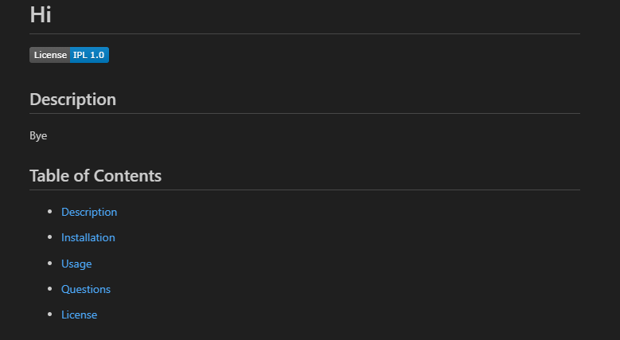

# Professional-ReadMe-Generator
The project uses node.js on javascript to help generate a readme file. On index.js it uses indicator from npm which provides the prompt format that is presented on terminal. When it generates the readme the formatting is formatted how it will be as a professional readme.

img: 